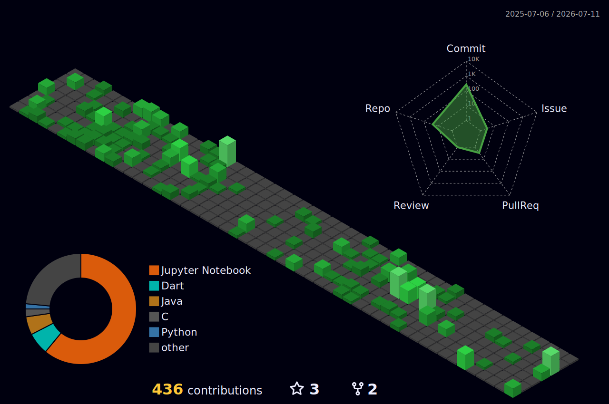

<h1 align="center">Hi 👋, I'm jeevan</h1>
<h3 align="center">A passionate coder from India who is enthusiastic to learn about everything</h3>

  

<h3 align="left">Connect with me:</h3>

<h3 align="left">Languages and Tools:</h3>

      

  Check out my Holopin Profile 👉 
  <a href="https://holopin.io/@jeevan841" target="_blank">Holopin</a>

<h3 align='center'><strong>Github Analytics</strong></h3>

 

<markdown-accessibility-table data-catalyst="">
  <table style="width: 100%; background-color: #1e1e1e; color: white; table-layout: fixed;">
    <thead>
      <tr>
        <th colspan="2" align="center">
          
        </th>
      </tr>
    </thead>
    <tbody>
      <tr>
        <td style="padding: 20px; text-align: center;">
          
        </td>
        <td style="padding: 20px; text-align: center;">
          
        </td>
      </tr>
      <tr>
        <td colspan="2" align="center">
           
        </td>
      </tr>
    </tbody>
  </table>
</markdown-accessibility-table>

<!---
jeevan841/jeevan841 is a ✨ special ✨ repository because its `README.md` (this file) appears on your GitHub profile.
You can click the Preview link to take a look at your changes.
--->
